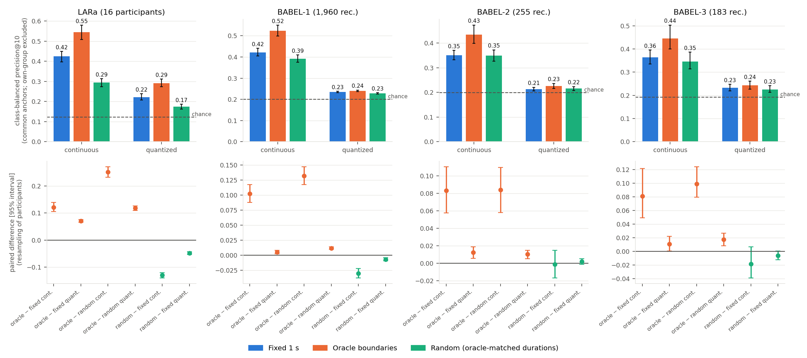
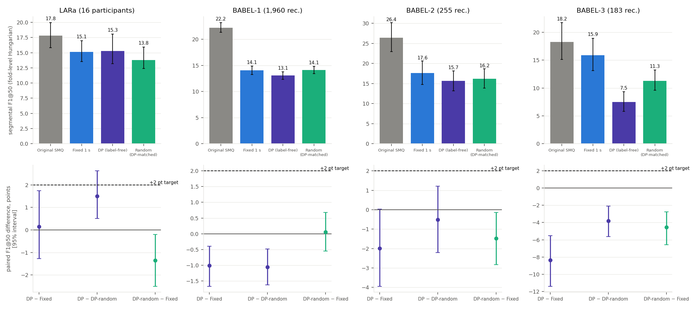

# RESULTS — first execution block (Experiments 1 and 2)

Written for: the project team deciding whether to invest the remaining submission time (companion: [DECISION.md](DECISION.md); protocol frozen in
[PROTOCOL.md](PROTOCOL.md); data/checkpoint facts in [EXPERIMENT_MANIFEST.md](EXPERIMENT_MANIFEST.md)).

All numbers below are generated from `results/seg/*.json` by `script/seg/make_tables.py` (nothing is copied by hand). Setting: **transductive** — the frozen
released encoders were trained without labels on every recording, including the evaluation ones; only the scaler and the k-means codebook are fitted out-of-fold.
Uncertainty = 95 % percentile interval from paired resampling (2,000 draws) of **participants (LARa, 16)** or **recordings (BABEL; no participant IDs)**; clustering-seed and
randomization variability are reported separately (T6, T19). BABEL-1/2/3 are related, **not independent replications**; BABEL-1 is the primary BABEL set.
Bold intervals exclude 0. Segmental F1 uses the fold-level Hungarian mapping (uses evaluation labels — a benchmark convention) unless stated.

## Summary

* **H1 (segmentation), Experiment 1.** With the frozen SMQ encoder, an 8-bin segment encoding over annotated action intervals retrieves same-action anchors from other
  participants/recordings better than the same encoding over duration-matched random intervals in all four datasets (continuous p@10: LARa +0.251, BABEL-1 +0.132,
  BABEL-2 +0.084, BABEL-3 +0.099; all intervals exclude 0) and better than fixed 1 s windows (+0.121, +0.102, +0.083, +0.081). Random boundaries are *worse* than the grid on LARa and
  BABEL-1, so this is not a duration/rate effect. **However** the oracle segments are label-pure by construction (anchor label = segment label for 100 % of anchors vs 91–96 % for the grid
  and 77–89 % for random), and among segments of ≥ 0.8 purity the oracle-vs-fixed continuous difference is ≈ 0 on LARa/BABEL-1/BABEL-2. The gain over the grid is largely the
  avoidance of transition-straddling segments.
* **Quantization (H2 side), Experiment 1.** After k-means at K = C the oracle advantage over fixed windows survives on LARa (+0.070) and is ≤ 0.013 on BABEL; quantized retrieval keeps 30–40 % (LARa) and
  10–24 % (BABEL) of the continuous lift over chance. No discretization *advantage* is shown (Experiment 3 was not launched).
* **Experiment 2 (label-free DP segmentation).** F1@50 (primary): DP − Fixed = +0.1 [−1.3, 1.7] LARa, −1.0 [−1.7, −0.4] BABEL-1, −2.0 [−4.0, 0.0] BABEL-2, −8.4 [−11.4, −5.5] BABEL-3, against a +2.0 target.
  No dataset satisfies the continuation rule under the primary mapping. DP recovers ~14 % of the oracle continuous-retrieval gain on LARa and none on BABEL.
* The controlled recipe itself (frozen latent + 8 bins + k-means on 1 s windows) is below original SMQ on F1@50 by 2.4–8.8 points (T10).



*Fig. 1. Top: common-anchor class-balanced precision@10 (each bar's interval is its own resampling interval). Bottom: paired differences. Dashed = chance.*

## Experiment 1 — oracle boundary diagnostic

Implementation checks that passed and are stored with the results (`results/seg/implementation_checks.json`, `raw/exp1_*.pkl → meta.checks`): every frame belongs to exactly one segment; durations sum to recording length;
oracle and random share the segment count and duration multiset in all 10 randomizations; no participant appears in both fitting and evaluation folds (LARa); common-anchor query populations are identical across all
conditions and Original SMQ (sha256 of anchors stored); labels never enter the scaler or k-means; original-SMQ frame codes reproduce the cached E0 predictions exactly.

### T1. Common-anchor retrieval — class-balanced precision@10 [95% interval over participants (LARa) / recordings (BABEL)]

Interval on each level is its own resampling interval (not paired). Mean over 3 k-means seeds (random: 10 randomizations × 3 seeds). Chance = random-ranking expectation under the same group exclusion.

| Dataset | readout | Fixed | Oracle | Random (oracle-matched) | Original SMQ | chance |
|---|---|---|---|---|---|---|
| LARa | continuous 8-bin | 0.425 [0.397, 0.449] | 0.546 [0.509, 0.580] | 0.295 [0.273, 0.313] | — | 0.122 |
| LARa | quantized prototype | 0.222 [0.207, 0.239] | 0.292 [0.274, 0.312] | 0.174 [0.163, 0.187] | 0.250 [0.235, 0.269] | 0.122 |
| BABEL-1 | continuous 8-bin | 0.422 [0.405, 0.440] | 0.524 [0.499, 0.551] | 0.392 [0.375, 0.409] | — | 0.201 |
| BABEL-1 | quantized prototype | 0.234 [0.231, 0.238] | 0.240 [0.236, 0.244] | 0.228 [0.225, 0.232] | 0.247 [0.244, 0.251] | 0.201 |
| BABEL-2 | continuous 8-bin | 0.350 [0.332, 0.370] | 0.434 [0.398, 0.473] | 0.349 [0.326, 0.372] | — | 0.198 |
| BABEL-2 | quantized prototype | 0.214 [0.206, 0.221] | 0.226 [0.215, 0.236] | 0.216 [0.208, 0.223] | 0.270 [0.258, 0.280] | 0.198 |
| BABEL-3 | continuous 8-bin | 0.364 [0.335, 0.395] | 0.444 [0.400, 0.503] | 0.345 [0.314, 0.386] | — | 0.191 |
| BABEL-3 | quantized prototype | 0.232 [0.218, 0.247] | 0.243 [0.226, 0.261] | 0.226 [0.213, 0.241] | 0.234 [0.222, 0.248] | 0.191 |

**Reading.** Continuous 8-bin retrieval is above chance everywhere and is best with oracle boundaries in every dataset.
Quantization to K = C prototypes leaves BABEL retrieval close to chance and removes roughly two thirds of the continuous lift over chance on LARa (T5).
Original SMQ's own quantized codes are shown for reference only (they come from a transductively trained codebook and 1 s patches).

### T2. Paired contrasts (bold = 95% interval excludes 0)

Difference in class-balanced precision@10 (common anchors).

| Dataset | readout | Oracle − Fixed | Oracle − Random | Random − Fixed |
|---|---|---|---|---|
| LARa | continuous | **0.121 [0.105, 0.139]** | **0.251 [0.232, 0.271]** | **-0.130 [-0.140, -0.121]** |
| LARa | quantized | **0.070 [0.065, 0.075]** | **0.118 [0.109, 0.126]** | **-0.048 [-0.053, -0.044]** |
| BABEL-1 | continuous | **0.102 [0.088, 0.117]** | **0.132 [0.118, 0.147]** | **-0.030 [-0.038, -0.022]** |
| BABEL-1 | quantized | **0.005 [0.003, 0.008]** | **0.012 [0.010, 0.014]** | **-0.007 [-0.009, -0.004]** |
| BABEL-2 | continuous | **0.083 [0.058, 0.111]** | **0.084 [0.058, 0.109]** | -0.001 [-0.017, 0.015] |
| BABEL-2 | quantized | **0.013 [0.006, 0.019]** | **0.011 [0.005, 0.015]** | 0.002 [-0.001, 0.006] |
| BABEL-3 | continuous | **0.081 [0.049, 0.122]** | **0.099 [0.079, 0.124]** | -0.018 [-0.039, 0.006] |
| BABEL-3 | quantized | **0.011 [0.000, 0.022]** | **0.017 [0.008, 0.026]** | -0.006 [-0.012, 0.000] |

**Reading.** Oracle beats both fixed and duration-matched random boundaries on the continuous readout in all four datasets, with paired
intervals excluding 0 (prespecified H1 criterion: met). Random − Fixed is negative on LARa and BABEL-1 and indistinguishable from 0 on
BABEL-2/3, so the oracle advantage is **not** explained by pooling duration or rate: random boundaries with the same duration multiset are
*worse* than the 1 s grid. On the quantized readout the oracle advantage is large on LARa (+0.07 over fixed) and small on BABEL (≤ 0.013,
intervals technically exclude 0 for BABEL-1/2; BABEL-3 touches 0). The prespecified "discretization problem" rule (continuous gain present, quantized
interval includes 0) is therefore **not literally met on BABEL**, but the magnitude is 5–16 % of the continuous oracle-vs-fixed gain (0.005/0.102, 0.013/0.083, 0.011/0.081), i.e. quantization at K = C
discards most of it there.

**Important qualification (see T4 and the purity table below).** Oracle segments are label-pure by construction, so an oracle segment always
contains the anchor's own action. This part of the oracle advantage is built into the diagnostic.

### T3. Secondary endpoints — paired contrasts

NMI: frame-level cluster/label NMI, mean over folds. MoF(transfer): train-fitted majority map (fitting labels). MoF(Hungarian): fold-level benchmark mapping (evaluation labels). MoF in points.

| Dataset | metric | Oracle − Fixed | Oracle − Random | Random − Fixed |
|---|---|---|---|---|
| LARa | NMI | **0.079 [0.077, 0.097]** | **0.146 [0.143, 0.174]** | **-0.068 [-0.085, -0.060]** |
| LARa | ARI | **0.037 [0.025, 0.060]** | **0.060 [0.053, 0.083]** | **-0.022 [-0.036, -0.016]** |
| LARa | MoF, train-fitted map (pts) | **3.7 [2.1, 5.4]** | **5.4 [4.2, 6.7]** | **-1.7 [-2.4, -0.8]** |
| LARa | MoF, fold Hungarian (pts) | **3.3 [1.5, 5.5]** | **5.8 [4.9, 7.4]** | **-2.5 [-4.0, -1.2]** |
| BABEL-1 | NMI | **0.013 [0.007, 0.022]** | **0.023 [0.018, 0.029]** | **-0.010 [-0.015, -0.003]** |
| BABEL-1 | ARI | **0.017 [0.013, 0.025]** | **0.017 [0.013, 0.023]** | 0.000 [-0.004, 0.006] |
| BABEL-1 | MoF, train-fitted map (pts) | -0.0 [-1.0, 0.9] | **1.8 [1.4, 2.3]** | **-1.9 [-2.8, -1.0]** |
| BABEL-1 | MoF, fold Hungarian (pts) | **2.9 [1.2, 4.0]** | **2.6 [1.4, 3.2]** | 0.4 [-0.8, 1.3] |
| BABEL-2 | NMI | **0.040 [0.031, 0.071]** | **0.024 [0.017, 0.046]** | **0.016 [0.005, 0.033]** |
| BABEL-2 | ARI | 0.017 [-0.000, 0.054] | **0.016 [0.005, 0.041]** | 0.001 [-0.017, 0.022] |
| BABEL-2 | MoF, train-fitted map (pts) | **3.8 [0.5, 6.7]** | **3.5 [1.4, 5.6]** | 0.3 [-1.7, 2.0] |
| BABEL-2 | MoF, fold Hungarian (pts) | **4.3 [0.9, 8.1]** | 1.6 [-0.7, 3.7] | **2.7 [0.6, 5.3]** |
| BABEL-3 | NMI | **0.041 [0.024, 0.103]** | **0.036 [0.017, 0.088]** | 0.005 [-0.014, 0.034] |
| BABEL-3 | ARI | **0.060 [0.017, 0.134]** | **0.065 [0.020, 0.120]** | -0.005 [-0.029, 0.038] |
| BABEL-3 | MoF, train-fitted map (pts) | 2.4 [-1.7, 6.0] | 2.1 [-0.3, 4.4] | 0.3 [-2.2, 2.8] |
| BABEL-3 | MoF, fold Hungarian (pts) | **7.8 [2.7, 12.3]** | **6.3 [1.7, 9.2]** | 1.5 [-1.9, 5.8] |

### T4. Segment-level retrieval (eligible segments only) and mixed-label sensitivity — paired contrasts on class-balanced precision@10

seg80 = segments with action purity ≥ 0.8 (same rule for every condition); seg00 = all segments incl. mixed-label (majority label as relevance).

| Dataset | set | readout | Oracle − Fixed | Oracle − Random | Random − Fixed |
|---|---|---|---|---|---|
| LARa | seg80 | cont | 0.001 [-0.013, 0.017] | **0.087 [0.067, 0.107]** | **-0.086 [-0.098, -0.073]** |
| LARa | seg80 | q | **0.056 [0.048, 0.065]** | **0.058 [0.048, 0.068]** | -0.002 [-0.008, 0.004] |
| LARa | seg00 | cont | **0.033 [0.020, 0.047]** | **0.122 [0.109, 0.134]** | **-0.088 [-0.097, -0.079]** |
| LARa | seg00 | q | **0.073 [0.066, 0.080]** | **0.088 [0.080, 0.094]** | **-0.015 [-0.019, -0.010]** |
| BABEL-1 | seg80 | cont | 0.004 [-0.017, 0.022] | **0.054 [0.046, 0.062]** | **-0.050 [-0.070, -0.034]** |
| BABEL-1 | seg80 | q | **-0.014 [-0.017, -0.010]** | **-0.009 [-0.012, -0.006]** | **-0.004 [-0.008, -0.001]** |
| BABEL-1 | seg00 | cont | **0.026 [0.009, 0.041]** | **0.075 [0.068, 0.082]** | **-0.049 [-0.064, -0.037]** |
| BABEL-1 | seg00 | q | **-0.004 [-0.007, -0.001]** | 0.000 [-0.002, 0.002] | **-0.004 [-0.006, -0.002]** |
| BABEL-2 | seg80 | cont | -0.017 [-0.035, 0.004] | **0.026 [0.014, 0.039]** | **-0.043 [-0.060, -0.025]** |
| BABEL-2 | seg80 | q | -0.005 [-0.014, 0.005] | **-0.011 [-0.017, -0.006]** | 0.007 [-0.004, 0.017] |
| BABEL-2 | seg00 | cont | -0.009 [-0.025, 0.010] | **0.030 [0.018, 0.042]** | **-0.039 [-0.055, -0.024]** |
| BABEL-2 | seg00 | q | -0.003 [-0.012, 0.006] | **-0.007 [-0.013, -0.002]** | 0.004 [-0.005, 0.013] |
| BABEL-3 | seg80 | cont | **0.057 [0.021, 0.089]** | **0.019 [0.003, 0.035]** | 0.038 [-0.000, 0.071] |
| BABEL-3 | seg80 | q | **0.073 [0.059, 0.086]** | **0.021 [0.013, 0.029]** | **0.052 [0.040, 0.063]** |
| BABEL-3 | seg00 | cont | **0.059 [0.022, 0.089]** | **0.025 [0.010, 0.040]** | 0.034 [-0.004, 0.065] |
| BABEL-3 | seg00 | q | **0.069 [0.055, 0.081]** | **0.019 [0.011, 0.027]** | **0.050 [0.038, 0.060]** |

**Reading.** When the query/gallery are restricted to segments of ≥ 0.8 action purity — the same rule for every condition — the continuous
oracle-vs-fixed difference is **~0** on LARa, BABEL-1 and BABEL-2 (intervals include 0) and positive only on BABEL-3. Oracle still beats random
on the continuous readout in all datasets. Together with the common-anchor result this says: relative to the 1 s grid, most of the common-anchor
oracle gain comes from not straddling annotated transitions (the anchor's segment matches its label), not from a better representation of the
content of already-pure segments. Relative to random partitions the advantage is real on both endpoints. On the quantized readout the oracle−fixed
difference at seg80 is positive on LARa (+0.056) and BABEL-3, negative on BABEL-1.

### T5. Continuous vs quantized (common anchors, precision@10 point estimates) and share of the continuous lift kept after quantization

| Dataset | condition | continuous lift over chance | quantized lift over chance | quantized / continuous |
|---|---|---|---|---|
| LARa | fixed | 0.303 | 0.100 | 0.33 |
| LARa | oracle | 0.424 | 0.170 | 0.40 |
| LARa | random | 0.173 | 0.052 | 0.30 |
| BABEL-1 | fixed | 0.221 | 0.034 | 0.15 |
| BABEL-1 | oracle | 0.323 | 0.039 | 0.12 |
| BABEL-1 | random | 0.191 | 0.027 | 0.14 |
| BABEL-2 | fixed | 0.152 | 0.015 | 0.10 |
| BABEL-2 | oracle | 0.235 | 0.028 | 0.12 |
| BABEL-2 | random | 0.151 | 0.017 | 0.12 |
| BABEL-3 | fixed | 0.172 | 0.041 | 0.24 |
| BABEL-3 | oracle | 0.253 | 0.051 | 0.20 |
| BABEL-3 | random | 0.154 | 0.034 | 0.22 |

**Reading.** After quantization the retained share of the continuous lift over chance is 0.30–0.40 on LARa and 0.10–0.24 on BABEL, for every partition.
Continuous retrieval is always better than quantized retrieval — this experiment gives **no evidence for a discretization advantage** (H2 is untestable
here; it needs Experiment 3, which was not launched).

### T6. Sources of variability at the point sample (SD)

Clustering-seed SD = SD over 3 k-means seeds (random: mean within-randomization SD). Randomization SD = SD over 10 duration-permutation draws of the seed-averaged score. Compare with the paired intervals above.

| Dataset | metric | Fixed seed SD | Oracle seed SD | Random seed SD | Random randomization SD |
|---|---|---|---|---|---|
| LARa | ca_cont_p | 0.0000 | 0.0000 | 0.0000 | 0.0025 |
| LARa | ca_q_p | 0.0009 | 0.0044 | 0.0014 | 0.0013 |
| LARa | cont_nmi | 0.0039 | 0.0041 | 0.0032 | 0.0027 |
| BABEL-1 | ca_cont_p | 0.0000 | 0.0000 | 0.0000 | 0.0058 |
| BABEL-1 | ca_q_p | 0.0008 | 0.0006 | 0.0008 | 0.0015 |
| BABEL-1 | cont_nmi | 0.0008 | 0.0007 | 0.0012 | 0.0025 |
| BABEL-2 | ca_cont_p | 0.0000 | 0.0000 | 0.0000 | 0.0125 |
| BABEL-2 | ca_q_p | 0.0048 | 0.0048 | 0.0024 | 0.0025 |
| BABEL-2 | cont_nmi | 0.0098 | 0.0071 | 0.0047 | 0.0052 |
| BABEL-3 | ca_cont_p | 0.0000 | 0.0000 | 0.0000 | 0.0101 |
| BABEL-3 | ca_q_p | 0.0009 | 0.0050 | 0.0056 | 0.0062 |
| BABEL-3 | cont_nmi | 0.0009 | 0.0068 | 0.0103 | 0.0095 |

**Reading.** The continuous readout does not depend on the k-means seed (SD 0). Quantized-readout seed SDs are ≤ 0.006 and randomization SDs ≤ 0.013, small
next to the LARa contrasts and comparable to the BABEL-1/2/3 *quantized* contrasts (≤ 0.013), which should therefore not be over-interpreted.

### T7. Informative-null sensitivity: recordings with ≥ 4 oracle segments and duration CV ≥ 0.25

| Dataset | recordings kept / total | readout | Oracle − Fixed | Oracle − Random | Random − Fixed |
|---|---|---|---|---|---|
| LARa | 436 / 439 | continuous | **0.121 [0.105, 0.140]** | **0.251 [0.232, 0.272]** | **-0.130 [-0.140, -0.121]** |
| LARa | 436 / 439 | quantized | **0.071 [0.065, 0.077]** | **0.119 [0.110, 0.127]** | **-0.048 [-0.053, -0.043]** |
| BABEL-1 | 1257 / 1960 | continuous | **0.116 [0.100, 0.133]** | **0.153 [0.140, 0.166]** | **-0.036 [-0.044, -0.029]** |
| BABEL-1 | 1257 / 1960 | quantized | **0.008 [0.005, 0.011]** | **0.013 [0.010, 0.015]** | **-0.005 [-0.008, -0.002]** |
| BABEL-2 | 107 / 255 | continuous | **0.066 [0.030, 0.109]** | **0.077 [0.043, 0.114]** | -0.011 [-0.038, 0.013] |
| BABEL-2 | 107 / 255 | quantized | 0.012 [-0.002, 0.021] | 0.008 [-0.002, 0.014] | 0.005 [-0.001, 0.009] |
| BABEL-3 | 35 / 183 | continuous | 0.103 [-0.065, 0.160] | 0.074 [-0.012, 0.115] | 0.029 [-0.047, 0.076] |
| BABEL-3 | 35 / 183 | quantized | -0.005 [-0.027, 0.014] | 0.010 [-0.008, 0.030] | **-0.015 [-0.028, -0.005]** |

**Reading.** Restricting to recordings for which the permutation null is informative leaves the LARa and BABEL-1 conclusions unchanged; BABEL-2 keeps its
continuous oracle advantage; BABEL-3 has only 35 informative recordings and its intervals include 0.

### T8. Null-partition informativeness (oracle-matched random)

| Dataset | recordings | single segment | < 4 segments | ≥ half of randomizations identical to oracle | duration CV < 0.25 |
|---|---|---|---|---|---|
| LARa | 439 | 1 | 3 | 1 | 1 |
| BABEL-1 | 1960 | 122 | 639 | 183 | 252 |
| BABEL-2 | 255 | 53 | 146 | 68 | 65 |
| BABEL-3 | 183 | 11 | 148 | 42 | 13 |

**Reading.** LARa's null is well posed (3/439 recordings with < 4 segments). BABEL's is weak: 33 %, 57 % and 81 % of BABEL-1/2/3 recordings have fewer than
four annotated runs. BABEL results against the random null are therefore less informative than LARa's.

**Anchor–segment label agreement** (share of common anchors whose label equals the majority label of the segment containing them; oracle = 100 % by construction):

| Dataset | Fixed 1 s | Oracle | Random (1 draw) | DP (label-free) |
|---|---|---|---|---|
| LARa | 93.8% | 100.0% | 76.7% | 93.8% |
| BABEL-1 | 90.6% | 100.0% | 83.1% | 86.7% |
| BABEL-2 | 93.2% | 100.0% | 85.1% | 95.1% |
| BABEL-3 | 95.8% | 100.0% | 89.2% | 95.8% |

### T9. Per-class coverage at the point sample (segment-level, purity ≥ 0.8, continuous): eligible queries per class and per-class precision


**LARa**

| condition | Standing | Walking | Cart | Handling(upwards) | Handling(centred) | Handling(downwards) | Synchronization | None |
|---|---|---|---|---|---|---|---|---|
| fixed: queries | 4309 | 5631 | 5773 | 3260 | 20388 | 2939 | 725 | 2086 |
| fixed: precision (chance) | 0.34 (0.10) | 0.36 (0.12) | 0.37 (0.12) | 0.53 (0.07) | 0.72 (0.44) | 0.64 (0.06) | 0.83 (0.02) | 0.04 (0.04) |
| oracle: queries | 3124 | 1666 | 940 | 1489 | 4830 | 1322 | 439 | 295 |
| oracle: precision (chance) | 0.46 (0.22) | 0.32 (0.12) | 0.26 (0.06) | 0.59 (0.10) | 0.51 (0.34) | 0.72 (0.09) | 0.97 (0.03) | 0.03 (0.02) |
| random: queries | 712 | 1034 | 1426 | 619 | 3644 | 552 | 108 | 354 |
| random: precision (chance) | 0.34 (0.09) | 0.31 (0.12) | 0.34 (0.14) | 0.43 (0.07) | 0.68 (0.44) | 0.58 (0.06) | 0.43 (0.01) | 0.03 (0.04) |

**BABEL-1**

| condition | walk | stand | turn | jump | none |
|---|---|---|---|---|---|
| fixed: queries | 6875 | 4359 | 787 | 505 | 3053 |
| fixed: precision (chance) | 0.69 (0.44) | 0.71 (0.28) | 0.19 (0.05) | 0.23 (0.04) | 0.51 (0.20) |
| oracle: queries | 2797 | 2445 | 1067 | 229 | 3388 |
| oracle: precision (chance) | 0.48 (0.28) | 0.69 (0.25) | 0.45 (0.11) | 0.12 (0.02) | 0.61 (0.34) |
| random: queries | 2570 | 1829 | 432 | 172 | 1518 |
| random: precision (chance) | 0.54 (0.39) | 0.71 (0.28) | 0.23 (0.07) | 0.12 (0.03) | 0.47 (0.23) |

**BABEL-2**

| condition | sit | run | stand_up | kick | none |
|---|---|---|---|---|---|
| fixed: queries | 1269 | 195 | 201 | 76 | 623 |
| fixed: precision (chance) | 0.85 (0.54) | 0.24 (0.09) | 0.12 (0.08) | 0.05 (0.02) | 0.57 (0.26) |
| oracle: queries | 210 | 104 | 130 | 51 | 459 |
| oracle: precision (chance) | 0.59 (0.22) | 0.22 (0.09) | 0.29 (0.13) | 0.04 (0.03) | 0.61 (0.48) |
| random: queries | 226 | 97 | 51 | 38 | 250 |
| random: precision (chance) | 0.69 (0.35) | 0.25 (0.13) | 0.11 (0.08) | 0.05 (0.04) | 0.52 (0.37) |

**BABEL-3**

| condition | jog | wave | dance | gesture | none |
|---|---|---|---|---|---|
| fixed: queries | 143 | 40 | 1154 | 672 | 557 |
| fixed: precision (chance) | 0.23 (0.05) | 0.04 (0.01) | 0.50 (0.43) | 0.48 (0.25) | 0.64 (0.22) |
| oracle: queries | 69 | 13 | 99 | 103 | 393 |
| oracle: precision (chance) | 0.22 (0.10) | 0.02 (0.02) | 0.43 (0.14) | 0.39 (0.16) | 0.69 (0.58) |
| random: queries | 63 | 11 | 124 | 115 | 197 |
| random: precision (chance) | 0.23 (0.12) | 0.02 (0.02) | 0.44 (0.23) | 0.47 (0.23) | 0.52 (0.39) |

**Reading.** Per-class coverage differs by partition (oracle has far fewer, purer queries per class). `None` on LARa has near-chance precision in every
condition. Small classes (`wave` in BABEL-3, `kick` in BABEL-2, `jump` in BABEL-1) have few queries and low absolute precision, so their contribution to the class-balanced mean is noisy.

### T10. Original SMQ vs controlled fixed-window representation (paired; Fixed − SMQ)

| Dataset | quantized retrieval p@10 | NMI | F1@50 (Hungarian) | Edit (Hungarian) |
|---|---|---|---|---|
| LARa | **-0.028 [-0.037, -0.020]** | **-0.023 [-0.038, -0.006]** | **-2.69 [-5.20, -0.21]** | **-8.34 [-12.08, -4.52]** |
| BABEL-1 | **-0.013 [-0.017, -0.009]** | **-0.013 [-0.021, -0.001]** | **-8.15 [-9.39, -6.97]** | **-10.10 [-11.12, -9.13]** |
| BABEL-2 | **-0.056 [-0.065, -0.048]** | **-0.110 [-0.140, -0.078]** | **-8.77 [-13.60, -4.71]** | -3.68 [-7.74, 0.35] |
| BABEL-3 | -0.002 [-0.015, 0.009] | -0.006 [-0.030, 0.008] | -2.37 [-4.84, 0.06] | -2.41 [-5.18, 0.43] |

**Reading.** The controlled recipe (frozen latent + 8-bin encoding + k-means, fixed 1 s windows) is **below original SMQ** on F1@50 and Edit in every dataset
(paired intervals exclude 0 in LARa, BABEL-1, BABEL-2 for F1@50). Original SMQ's codebook was trained jointly with the encoder on 1 s patches, so one *untested* explanation is that the frozen latent is co-adapted to that
quantizer and k-means on an 8-bin encoding is a weaker quantizer for it. This is the reference the controlled conditions are compared to, and it is a caveat on every segmentation-first number here.

### T11. Sensitivity: duration-weighted k-means fitting (Experiment 1, common-anchor p@10, paired)

| Dataset | readout | Oracle − Fixed | Oracle − Random | Random − Fixed |
|---|---|---|---|---|
| LARa | continuous | **0.121 [0.105, 0.139]** | **0.251 [0.232, 0.271]** | **-0.130 [-0.140, -0.121]** |
| LARa | quantized | **0.060 [0.054, 0.067]** | **0.114 [0.104, 0.124]** | **-0.054 [-0.061, -0.047]** |
| BABEL-1 | continuous | **0.102 [0.088, 0.117]** | **0.132 [0.118, 0.147]** | **-0.030 [-0.038, -0.022]** |
| BABEL-1 | quantized | **0.011 [0.008, 0.013]** | **0.012 [0.009, 0.014]** | -0.001 [-0.004, 0.002] |

## Experiment 2

**Reading.** Fitting k-means with duration weights (each segment weighted by its frames) leaves the conclusions unchanged: the continuous readout does not depend on clustering, and the quantized contrasts are close to the unweighted ones (LARa oracle − fixed +0.060 vs +0.070; BABEL-1 +0.011 vs +0.005). Run for LARa and BABEL-1 only.

## Experiment 2 — label-free variable-duration segmentation (feasibility pilot)

DP: exact minimization of Σ linear-fit residual + λ·N_segments, min 0.25 s / max 10 s (LARa 13–500 frames, BABEL 8–300), λ chosen per fold on unlabelled fitting recordings to match the
one-second grid's event rate (Deviation D1 in PROTOCOL.md: rate matched on all fitting recordings). Exactness was validated on 36 brute-force-solvable cases. Conditions: Original SMQ, Fixed 1 s + shared encoder + k-means,
DP + shared encoder + k-means, DP-count-and-duration-matched random (10 draws), 3 k-means seeds each.



*Fig. 2. Top: F1@50 (Hungarian mapping). Bottom: paired differences; dashed line = the prespecified +2-point target.*

### T12. Segmental metrics by condition (fold-level Hungarian mapping; mean over seeds/randomizations; [95% interval])

| Dataset | condition | F1@10 | F1@25 | **F1@50** | Edit | MoF |
|---|---|---|---|---|---|---|
| LARa | Original SMQ | 37.1 [34.4, 40.2] | 30.6 [28.2, 33.0] | 17.8 [15.8, 19.9] | 41.4 [39.1, 43.9] | 38.4 [35.1, 44.3] |
| LARa | Fixed 1 s (controlled) | 32.2 [29.6, 34.7] | 26.1 [23.6, 28.5] | 15.1 [13.6, 17.0] | 33.0 [29.7, 36.4] | 33.7 [32.1, 42.0] |
| LARa | DP variable (label-free) | 33.5 [30.4, 37.5] | 26.3 [23.5, 30.0] | 15.3 [13.2, 18.1] | 35.5 [33.7, 37.6] | 35.0 [32.9, 43.0] |
| LARa | Random, DP-matched | 33.4 [30.7, 36.7] | 25.7 [23.2, 29.0] | 13.8 [12.4, 15.9] | 34.3 [31.8, 36.7] | 34.0 [32.0, 41.7] |
| BABEL-1 | Original SMQ | 41.9 [41.0, 42.9] | 33.2 [32.1, 34.3] | 22.2 [21.3, 23.2] | 38.8 [37.9, 39.7] | 37.0 [35.9, 38.5] |
| BABEL-1 | Fixed 1 s (controlled) | 34.5 [33.6, 35.4] | 27.1 [26.2, 28.0] | 14.1 [13.3, 14.9] | 28.7 [27.8, 29.5] | 36.0 [35.5, 37.5] |
| BABEL-1 | DP variable (label-free) | 35.1 [34.3, 35.9] | 25.9 [25.1, 26.8] | 13.1 [12.4, 13.8] | 29.1 [28.4, 29.8] | 36.9 [36.3, 38.4] |
| BABEL-1 | Random, DP-matched | 34.9 [34.1, 35.7] | 26.5 [25.6, 27.3] | 14.1 [13.4, 14.8] | 29.7 [28.9, 30.5] | 36.3 [35.7, 37.8] |
| BABEL-2 | Original SMQ | 41.9 [38.0, 46.0] | 36.0 [31.9, 40.1] | 26.4 [22.9, 30.2] | 34.9 [31.9, 38.0] | 50.2 [47.1, 54.9] |
| BABEL-2 | Fixed 1 s (controlled) | 30.6 [27.4, 34.0] | 25.6 [22.4, 29.0] | 17.6 [14.7, 20.6] | 31.3 [28.1, 34.5] | 40.2 [37.8, 45.0] |
| BABEL-2 | DP variable (label-free) | 30.9 [27.9, 34.0] | 24.4 [21.6, 27.4] | 15.7 [13.2, 18.2] | 27.9 [26.0, 29.7] | 45.8 [42.9, 50.2] |
| BABEL-2 | Random, DP-matched | 29.9 [27.1, 32.9] | 23.7 [21.1, 26.6] | 16.2 [13.9, 18.7] | 30.3 [27.5, 33.0] | 41.0 [38.8, 45.8] |
| BABEL-3 | Original SMQ | 35.1 [31.5, 38.9] | 26.8 [23.2, 31.1] | 18.2 [15.1, 21.7] | 35.5 [31.7, 39.4] | 41.9 [39.7, 47.9] |
| BABEL-3 | Fixed 1 s (controlled) | 32.3 [28.9, 35.8] | 23.7 [20.5, 27.3] | 15.9 [13.1, 18.9] | 33.1 [29.7, 36.6] | 42.1 [41.1, 47.9] |
| BABEL-3 | DP variable (label-free) | 25.7 [23.5, 28.1] | 15.4 [13.2, 17.8] | 7.5 [5.8, 9.3] | 28.2 [25.8, 30.4] | 42.6 [40.5, 48.4] |
| BABEL-3 | Random, DP-matched | 26.2 [23.8, 28.9] | 19.1 [16.9, 21.6] | 11.3 [9.6, 13.2] | 27.3 [24.8, 30.0] | 41.8 [40.8, 47.2] |

**Reading.** Values are levels; the Original SMQ row uses the same folds and Hungarian mapping but its own released codes.

### T13. Paired contrasts, Hungarian mapping (bold = interval excludes 0)

| Dataset | contrast | ΔF1@10 | ΔF1@25 | **ΔF1@50** | ΔEdit | ΔMoF (pts) |
|---|---|---|---|---|---|---|
| LARa | DP − Fixed | 1.2 [-2.0, 4.9] | 0.2 [-2.2, 2.9] | 0.1 [-1.3, 1.7] | 2.5 [-0.9, 6.2] | 1.3 [-0.3, 2.5] |
| LARa | DP − DP-random | 0.1 [-1.5, 1.8] | 0.5 [-0.6, 1.8] | **1.5 [0.5, 2.6]** | 1.2 [-0.5, 3.0] | 1.0 [-0.1, 2.3] |
| LARa | DP-random − Fixed | 1.2 [-2.0, 4.4] | -0.3 [-2.6, 2.1] | **-1.3 [-2.5, -0.2]** | 1.3 [-2.0, 4.8] | 0.3 [-1.3, 1.2] |
| BABEL-1 | DP − Fixed | 0.5 [-0.3, 1.3] | **-1.2 [-2.0, -0.4]** | **-1.0 [-1.7, -0.4]** | 0.4 [-0.4, 1.1] | **1.0 [0.1, 1.5]** |
| BABEL-1 | DP − DP-random | 0.2 [-0.5, 0.8] | -0.5 [-1.3, 0.2] | **-1.1 [-1.6, -0.5]** | **-0.7 [-1.3, -0.0]** | 0.6 [-0.2, 1.4] |
| BABEL-1 | DP-random − Fixed | 0.4 [-0.5, 1.2] | -0.7 [-1.4, 0.1] | 0.1 [-0.6, 0.7] | **1.1 [0.2, 1.8]** | 0.3 [-0.6, 1.0] |
| BABEL-2 | DP − Fixed | 0.4 [-2.0, 2.7] | -1.2 [-3.7, 1.3] | -2.0 [-4.0, 0.0] | **-3.4 [-6.1, -0.7]** | **5.6 [2.3, 8.3]** |
| BABEL-2 | DP − DP-random | 1.0 [-0.8, 2.7] | 0.6 [-1.2, 2.6] | -0.5 [-2.2, 1.2] | -2.4 [-4.8, 0.1] | **4.8 [1.7, 7.1]** |
| BABEL-2 | DP-random − Fixed | -0.6 [-2.2, 0.9] | **-1.8 [-3.4, -0.3]** | **-1.5 [-2.8, -0.1]** | -1.0 [-2.6, 0.5] | 0.8 [-0.2, 2.0] |
| BABEL-3 | DP − Fixed | **-6.5 [-10.0, -3.1]** | **-8.3 [-12.0, -4.9]** | **-8.4 [-11.4, -5.5]** | **-4.9 [-8.0, -1.9]** | 0.5 [-5.0, 4.4] |
| BABEL-3 | DP − DP-random | -0.5 [-3.1, 2.1] | **-3.7 [-6.1, -1.4]** | **-3.8 [-5.6, -2.1]** | 0.9 [-1.3, 3.2] | 0.8 [-3.0, 3.6] |
| BABEL-3 | DP-random − Fixed | **-6.1 [-8.3, -3.7]** | **-4.7 [-7.0, -2.5]** | **-4.6 [-6.6, -2.8]** | **-5.8 [-8.0, -3.6]** | -0.3 [-3.1, 1.8] |

**Reading (primary endpoint F1@50).** Label-free DP segmentation does **not** improve F1@50 over fixed 1 s windows under the primary mapping in any dataset:
LARa +0.1 [−1.3, 1.7]; BABEL-1 −1.0 [−1.7, −0.4]; BABEL-2 −2.0 [−4.0, 0.0]; BABEL-3 −8.4 [−11.4, −5.5]. The prespecified target was +2.0. On LARa, DP is better than the
matched random partition (+1.5 [0.5, 2.6]), so its boundaries carry some non-random information there, but the gain over the grid is nil.

### T14. Same contrasts under the train-fitted mapping (descriptive; see caveat on label collapse)

| Dataset | contrast | ΔF1@50 | ΔEdit | ΔMoF (pts) |
|---|---|---|---|---|
| LARa | DP − Fixed | **2.1 [0.5, 3.8]** | 2.8 [-0.2, 5.6] | 0.2 [-0.7, 1.1] |
| LARa | DP − DP-random | **3.0 [1.7, 4.4]** | **3.1 [0.9, 5.1]** | 0.2 [-0.5, 0.9] |
| LARa | DP-random − Fixed | -0.9 [-1.9, 0.1] | -0.3 [-2.0, 1.7] | -0.0 [-0.4, 0.5] |
| BABEL-1 | DP − Fixed | 0.2 [-0.5, 0.8] | **9.8 [8.9, 10.5]** | **-0.8 [-1.7, -0.1]** |
| BABEL-1 | DP − DP-random | **-2.7 [-3.6, -1.8]** | **7.3 [6.4, 8.3]** | -0.2 [-0.6, 0.2] |
| BABEL-1 | DP-random − Fixed | **2.8 [2.1, 3.6]** | **2.4 [1.8, 3.0]** | -0.6 [-1.4, 0.1] |
| BABEL-2 | DP − Fixed | **-2.8 [-4.9, -0.9]** | **16.5 [12.4, 20.6]** | **2.3 [0.9, 3.8]** |
| BABEL-2 | DP − DP-random | **-1.9 [-3.8, -0.1]** | **15.5 [11.5, 19.4]** | **2.4 [1.1, 4.0]** |
| BABEL-2 | DP-random − Fixed | -0.9 [-2.0, 0.1] | **1.0 [0.2, 1.9]** | -0.2 [-0.8, 0.5] |
| BABEL-3 | DP − Fixed | 1.7 [-1.8, 5.1] | **26.2 [21.8, 30.5]** | **3.4 [0.2, 6.9]** |
| BABEL-3 | DP − DP-random | **3.9 [1.7, 6.2]** | **32.3 [28.0, 36.5]** | **3.5 [1.7, 5.8]** |
| BABEL-3 | DP-random − Fixed | -2.2 [-4.9, 0.4] | **-6.1 [-8.8, -3.4]** | -0.1 [-2.5, 2.6] |

**Caveat.** The train-fitted majority mapping reaches only 1.4–3.3 of the 5–8 labels on average (label collapse), so Edit and F1 under it are dominated by
how many runs the label sequence collapses to (Edit differences of +10 to +26 points on BABEL are an artifact of that, not segmentation quality). It was not
prespecified as the primary readout. The LARa +2.1 [0.5, 3.8] F1@50 gain under this mapping is reported as a mapping-dependent observation, **not** as evidence
of advance.

### T15. Continuation rule (PROTOCOL §5)

(a) ΔF1@50 ≥ 2.0 with interval excluding 0; (b) ΔEdit ≥ 0 and ΔMoF ≥ −1 pt; (c1) random explains < ½ of the gain; (c2) DP − DP-random interval excludes 0. ADVANCE = a∧b∧c1∧c2.

| Dataset | mapping | a | b | c1 | c2 | ADVANCE |
|---|---|---|---|---|---|---|
| LARa | Hungarian (primary) | no | yes | yes | yes | **no** |
| LARa | train-fitted | yes | yes | yes | yes | **yes** |
| BABEL-1 | Hungarian (primary) | no | yes | no | no | **no** |
| BABEL-1 | train-fitted | no | yes | no | no | **no** |
| BABEL-2 | Hungarian (primary) | no | no | yes | no | **no** |
| BABEL-2 | train-fitted | no | yes | no | no | **no** |
| BABEL-3 | Hungarian (primary) | no | no | yes | no | **no** |
| BABEL-3 | train-fitted | no | yes | yes | yes | **no** |

**Outcome.** No dataset advances under the primary (Hungarian) mapping. LARa passes only under the train-fitted mapping (see caveat above).

### T16. Common-anchor retrieval and NMI, DP vs Fixed vs Oracle (paired), and the share of the oracle gain recovered

| Dataset | readout | DP − Fixed | Oracle − Fixed | ratio (DP gain / oracle gain) |
|---|---|---|---|---|
| LARa | continuous p@10 | **0.016 [0.011, 0.022]** | **0.121 [0.105, 0.139]** | 0.14 |
| LARa | quantized p@10 | **0.003 [0.001, 0.004]** | **0.070 [0.065, 0.075]** | 0.04 |
| LARa | NMI | 0.004 [-0.004, 0.010] | **0.079 [0.077, 0.097]** | 0.05 |
| BABEL-1 | continuous p@10 | **-0.019 [-0.026, -0.013]** | **0.102 [0.088, 0.117]** | -0.19 |
| BABEL-1 | quantized p@10 | **-0.007 [-0.009, -0.006]** | **0.005 [0.003, 0.008]** | -1.40 |
| BABEL-1 | NMI | **-0.011 [-0.016, -0.007]** | **0.013 [0.007, 0.022]** | -0.84 |
| BABEL-2 | continuous p@10 | 0.004 [-0.005, 0.014] | **0.083 [0.058, 0.111]** | 0.05 |
| BABEL-2 | quantized p@10 | 0.001 [-0.002, 0.004] | **0.013 [0.006, 0.019]** | 0.05 |
| BABEL-2 | NMI | -0.003 [-0.018, 0.004] | **0.040 [0.031, 0.071]** | -0.07 |
| BABEL-3 | continuous p@10 | -0.006 [-0.016, 0.002] | **0.081 [0.049, 0.122]** | -0.08 |
| BABEL-3 | quantized p@10 | -0.008 [-0.017, 0.001] | **0.011 [0.000, 0.022]** | -0.75 |
| BABEL-3 | NMI | -0.014 [-0.044, 0.000] | **0.041 [0.024, 0.103]** | -0.33 |

A ratio is meaningful only when both gains are positive and the oracle gain's interval excludes 0.

**Reading.** On LARa DP gives a small but positive continuous retrieval gain over fixed (+0.016), about 14 % of the oracle gain (+0.121); its quantized and NMI gains are
≈ 0. On BABEL DP is neutral or worse. DP therefore recovers little to none of the oracle advantage.

### T17. Class-agnostic boundary precision / recall / F1 (one-to-one matching, ±0.5 s), point estimates

Boundaries = changes in the frame-level cluster sequence ("code change"); "cut" = raw segment edges.

| Dataset | condition | code-change P | R | F1 | cut P | R | F1 |
|---|---|---|---|---|---|---|---|
| LARa | Original SMQ | 41.0 | 54.9 | 47.0 | 25.1 | 95.9 | 39.8 |
| LARa | Fixed | 43.2 | 42.0 | 42.6 | 25.1 | 95.9 | 39.8 |
| LARa | DP | 43.1 | 42.6 | 42.9 | 23.5 | 89.9 | 37.3 |
| LARa | DP-random | 39.2 | 36.6 | 37.9 | 21.1 | 80.4 | 33.4 |
| LARa | Oracle | 100.0 | 50.9 | 67.4 | 100.0 | 100.0 | 100.0 |
| BABEL-1 | Original SMQ | 50.8 | 34.1 | 40.8 | 36.2 | 81.1 | 50.1 |
| BABEL-1 | Fixed | 48.4 | 18.0 | 26.2 | 36.2 | 81.1 | 50.1 |
| BABEL-1 | DP | 37.1 | 21.7 | 27.3 | 30.6 | 68.6 | 42.3 |
| BABEL-1 | DP-random | 44.5 | 18.2 | 25.9 | 28.4 | 63.8 | 39.3 |
| BABEL-1 | Oracle | 100.0 | 29.1 | 45.0 | 100.0 | 100.0 | 100.0 |
| BABEL-2 | Original SMQ | 34.5 | 30.0 | 32.1 | 24.6 | 87.6 | 38.4 |
| BABEL-2 | Fixed | 32.4 | 21.9 | 26.1 | 24.6 | 87.6 | 38.4 |
| BABEL-2 | DP | 22.6 | 23.9 | 23.2 | 24.7 | 87.4 | 38.5 |
| BABEL-2 | DP-random | 32.2 | 22.1 | 26.2 | 20.7 | 73.3 | 32.3 |
| BABEL-2 | Oracle | 100.0 | 28.2 | 44.0 | 100.0 | 100.0 | 100.0 |
| BABEL-3 | Original SMQ | 20.9 | 31.4 | 25.1 | 16.4 | 87.4 | 27.6 |
| BABEL-3 | Fixed | 20.3 | 29.6 | 24.0 | 16.4 | 87.4 | 27.6 |
| BABEL-3 | DP | 16.0 | 27.1 | 20.1 | 15.0 | 80.8 | 25.2 |
| BABEL-3 | DP-random | 13.7 | 21.1 | 16.6 | 11.8 | 63.9 | 20.0 |
| BABEL-3 | Oracle | 100.0 | 43.7 | 60.8 | 100.0 | 100.0 | 100.0 |

DP − Fixed paired difference in raw-cut boundary F1 (±0.5 s):

| Dataset | Δ cut F1 | Δ code-change F1 |
|---|---|---|
| LARa | -2.5 [-5.0, 0.1] | 0.3 [-0.5, 1.2] |
| BABEL-1 | **-7.8 [-8.7, -6.9]** | **1.2 [0.2, 2.1]** |
| BABEL-2 | 0.1 [-2.9, 2.9] | -2.9 [-7.1, 1.3] |
| BABEL-3 | -2.4 [-4.6, 0.0] | **-3.9 [-7.9, -0.1]** |

**Reading.** The 1 s grid has ~96 % (LARa) / 81–88 % (BABEL) raw-cut recall at ±0.5 s simply because it places a cut every second — recall at this tolerance is
not discriminative for a one-event-per-second segmenter. DP's raw cuts are not better aligned to annotated boundaries than the grid (Δ cut-F1: LARa −2.5, BABEL-1 −7.8, BABEL-2 +0.1, BABEL-3 −2.4).
Code-change boundary F1 differences are +0.3 (LARa) and +1.2 (BABEL-1) but −2.9 (BABEL-2) and −3.9 (BABEL-3).

### T18. DP segmentation descriptives (no success criterion)

| Dataset | segments/s (grid = ~1) | DP duration median / p10–p90 (s) | GT duration median / p10–p90 (s) | at min bound (0.25 s) | at max bound (10 s) | λ per fold | rate matched on fitting set (±2%) |
|---|---|---|---|---|---|---|---|
| LARa | 0.999 | 0.78 / 0.52–1.66 | 2.20 / 0.82–7.11 | 1.9% | 0.21% | 1.78, 1.54, 1.33, 1.54 | yes |
| BABEL-1 | 1.046 | 0.67 / 0.27–1.83 | 1.20 / 0.30–3.80 | 21.3% | 0.07% | 0.93, 0.87, 0.87, 0.93, 0.93 | yes |
| BABEL-2 | 1.034 | 0.60 / 0.27–1.70 | 1.70 / 0.50–6.41 | 22.2% | 0.33% | 0.75, 0.65, 0.75, 0.75, 0.65 | yes |
| BABEL-3 | 1.037 | 0.60 / 0.27–1.90 | 1.77 / 0.47–11.58 | 15.3% | 0.04% | 1.33, 1.33, 1.43, 1.43, 1.24 | yes |

**Reading.** The DP hits the rate target on the fitting set (all folds) and rarely saturates the 10 s maximum, but 15–22 % of BABEL segments sit at the 0.25 s
minimum (LARa 1.9 %). DP segment durations (median 0.6–0.8 s) are much shorter than annotated durations (median 1.2–2.2 s). A better duration histogram is not a success criterion
and is not claimed as one.

### T19. Clustering-seed SD and randomization SD, F1@50 (Hungarian)

| Dataset | Fixed seed SD | DP seed SD | DP-random seed SD | DP-random randomization SD |
|---|---|---|---|---|
| LARa | 0.12 | 0.83 | 0.29 | 0.36 |
| BABEL-1 | 0.27 | 0.29 | 0.11 | 0.19 |
| BABEL-2 | 1.30 | 1.10 | 0.90 | 0.93 |
| BABEL-3 | 1.62 | 0.46 | 1.13 | 0.76 |

**Reading.** Seed and randomization SDs are ≤ 0.9 points on LARa/BABEL-1 and up to 1.6 on BABEL-2/3; differences of this size are not findings.

## Retrieval examples

`results/seg/retrieval_examples_lara.md` and `retrieval_examples_babel1.md` list, for two anchors per class chosen by a SHA-256 ordering (not by outcome), the top-3 nearest gallery
anchors under fixed and oracle segmentation with ✔/✘ for label agreement. They show failures as well as successes.

## Per-recording machine-readable outputs

`results/seg/per_recording_exp1_<dataset>.csv` and `per_recording_exp2_<dataset>.csv` (per recording × condition: segment counts, correct frames under both mappings, retrieval sums and counts, F1/boundary
tp/fp/fn components, DP bound counts); raw arrays with all seeds and randomizations in `results/seg/raw/*.pkl`; summaries with intervals in `results/seg/exp{1,2}_summary_<dataset>.json`; anchor–segment label agreement in `results/seg/anchor_purity.json`.

## Deviations, limits and what was not done

* **Deviation D1** (PROTOCOL.md §8): λ is matched on all fitting recordings rather than ≤ 40; decided from unlabelled rates before any Exp 2 evaluation metric was viewed.
* One BABEL-3 debugging run of Experiments 1–2 preceded the frozen protocol/rerun; all reported BABEL-3 numbers come from the final code.
* Exp 1 and 2 were first launched as one background loop; BABEL-1 and LARa Exp 1 crashed once (OpenBLAS thread oversubscription segfault) and were rerun unchanged with capped BLAS threads.
* Not done (by design of this block): Experiment 3, a 4K vocabulary sensitivity, encoder-seed replication, bin-count sweep, additional segmentation algorithms, additional datasets.
* The palette validator could not be run (`node` unavailable); figures use documented palette slots with direct labels.
* Exp 2's F1 mapping is held fixed at the point-sample mapping when resampling (intervals are conditional on it); MoF re-estimates the Hungarian mapping on each draw.
* Original SMQ is evaluated with the same folds and mapping but uses its own released, transductively trained codebook; it is a reference, not a controlled condition.
* Oracle segments are label-pure by construction; the oracle advantage over fixed windows is therefore partly definitional (see summary and T4).

## Reproduce

```powershell
$py = 'C:/Users/gzaz976/AppData/Local/anaconda3/envs/smq/python.exe'
& $py script/seg/audit_data.py; & $py script/seg/extract.py; & $py script/seg/tests.py
foreach ($d in 'babel3','babel2','babel1','lara') { & $py script/seg/exp1.py --dataset $d }
foreach ($d in 'babel3','babel2','babel1','lara') { & $py script/seg/exp2.py --dataset $d }
foreach ($d in 'lara','babel1','babel2','babel3') { & $py script/seg/summarize.py exp1 --dataset $d; & $py script/seg/summarize2.py --dataset $d }
& $py script/seg/anchor_purity.py; & $py script/seg/make_tables.py; & $py script/seg/build_results.py; & $py script/seg/figures.py
```
(set `OPENBLAS_NUM_THREADS=8 OMP_NUM_THREADS=8` on this 32-thread machine.)
